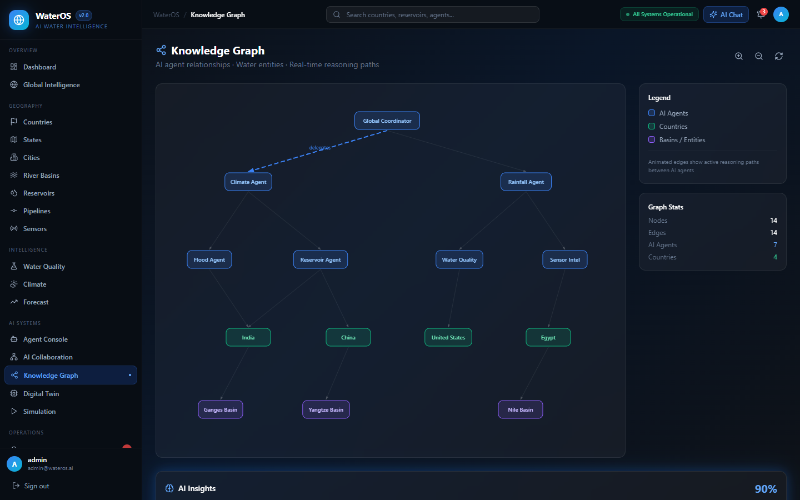

<div align="center">

# 💧 WaterOS

### AI-Native Multi-Agent Water Intelligence Platform

*Google AI Hackathon 2025*

[](https://google.com)
[](https://deepmind.google/gemini)
[](https://fastapi.tiangolo.com)
[](https://react.dev)
[](https://docker.com)
[](https://postgresql.org)

<br/>

> **WaterOS** is an enterprise-grade, AI-first platform that deploys 14 autonomous agents to monitor, predict, optimize, and protect global water resources in real time. It demonstrates multi-agent orchestration, agent memory, live observability, MCP tooling, and explainable AI — applied to one of humanity's most critical challenges.

<br/>

[](http://localhost:3000)
[](http://localhost:8000/docs)
[](./docs/architecture.md)

</div>

---

## ✨ What Makes WaterOS Different

| Capability | Description |
|-----------|-------------|
| 🤖 **14 Autonomous AI Agents** | Specialized agents for flood, rainfall, reservoir, quality, leaks, climate, emergency, and more — all powered by Gemini 1.5 Pro |
| 🧠 **Agent Memory** | Episodic memory stored in PostgreSQL — agents remember past runs and enrich future analysis with historical context |
| 🔍 **Live Observability** | Real-time execution traces, reasoning step animation, session history, per-agent performance metrics |
| 🔗 **Agent-to-Agent Communication** | Agents invoke each other in chains (e.g., Decision Agent orchestrates Flood + Reservoir + Quality agents) |
| 🛠 **MCP Server** | 8 standardized Model Context Protocol tools for water system interaction |
| 🌐 **Global → City Drill-Down** | Hierarchical intelligence: Global → Country → State → City with scoped AI insights at every level |
| 📡 **Real-time WebSocket Streams** | Live sensor telemetry and agent status pushed every 3–5 seconds |
| 🧬 **Digital Twin** | Simulate flood, drought, and contamination scenarios with what-if analysis |
| 📊 **Explainable AI** | Every recommendation shows the full reasoning chain, confidence score, tools called, and agents invoked |
| 🔒 **Production-Ready** | JWT auth, RBAC, Kafka event streaming, Redis caching, Qdrant vector search |

---

## 🖥 Screenshots

| Dashboard — KPIs + AI Reasoning | Global Intelligence — 195 Countries |
|----------------------------------|--------------------------------------|
|  |  |

| Countries Drill-Down + AI Insights | Live Sensor Grid (5s refresh) |
|------------------------------------|-------------------------------|
|  |  |

| Agent Console — Live Trace Animation | Observability Panel — Session History |
|--------------------------------------|---------------------------------------|
|  |  |

| Knowledge Graph — 60 Nodes | Digital Twin Simulation |
|---------------------------|-------------------------|
|  |  |

> Generate screenshots: `docker compose up -d && node scripts/take-screenshots.mjs`

---

## 🏗 Architecture

```
┌─────────────────────────────────────────────────────────────────────────┐
│                         PRESENTATION LAYER                               │
│  React 19 + TypeScript + Vite  ·  Zustand  ·  React Query  ·  :3000     │
│                                                                          │
│  Dashboard · Map · Countries · Rivers · Pipelines · Sensors · Cities    │
│  Water Quality · Climate · Forecast · Alerts · Reports · Settings       │
│                                                                          │
│  ┌─────────────────────┐  ┌───────────────────┐  ┌──────────────────┐   │
│  │  Agent Console       │  │  Observability    │  │  Knowledge Graph │   │
│  │  14 AI agents        │  │  Session history  │  │  Digital Twin    │   │
│  │  Live step trace     │  │  Live metrics     │  │  Workflow viz    │   │
│  │  Decision Agent chat │  │  Agent memory     │  │  Reports         │   │
│  └─────────────────────┘  └───────────────────┘  └──────────────────┘   │
└────────────────────────────────┬────────────────────────────────────────┘
                                 │  REST + WebSocket
                                 ▼
┌─────────────────────────────────────────────────────────────────────────┐
│                            API LAYER  ·  FastAPI  ·  :8000               │
│  JWT Auth · CORS · GZip · Async SQLAlchemy · Pydantic v2                │
│                                                                          │
│  /auth  /dashboard  /countries  /states  /cities  /rivers               │
│  /reservoirs  /pipelines  /sensors  /water-quality  /climate            │
│  /forecast  /alerts  /reports  /simulation  /graph  /mcp                │
│                                                                          │
│  ┌─────────────────────────────────────────────────────────────────┐    │
│  │  /agents — Session + Memory + Observability                      │    │
│  │  POST /run     → execute + save AgentExecution + write memory    │    │
│  │  POST /chat    → Decision Agent chat + persist to DB             │    │
│  │  GET  /sessions       → full run history from PostgreSQL         │    │
│  │  GET  /observability  → aggregate stats + per-agent metrics      │    │
│  │  GET  /memory/{id}    → episodic memories per agent              │    │
│  └─────────────────────────────────────────────────────────────────┘    │
│                                                                          │
│  WS /ws/live-data  (sensor telemetry, 5s)                               │
│  WS /ws/agents     (agent status stream, 3s)                            │
└──────┬──────────────────────────────────────────┬────────────────────────┘
       │                                          │
       ▼                                          ▼
┌──────────────────────────┐         ┌────────────────────────────────────┐
│   AI AGENT LAYER          │         │         DATA LAYER                 │
│   Google ADK + Gemini     │         │                                    │
│                           │         │  PostgreSQL :5432                  │
│   Rainfall Agent          │         │  · Countries, rivers, sensors      │
│   Reservoir Agent         │         │  · AgentExecution (session hist)   │
│   Flood Agent             │         │  · AgentMemory (episodic memory)   │
│   Water Quality Agent     │         │  · Users, alerts, reports          │
│   Leak Detection Agent    │         │                                    │
│   Climate Agent           │         │  Redis :6379                       │
│   Emergency Agent         │         │  · Auth token cache                │
│   Country Agent           │         │  · Agent state, pub/sub            │
│   Groundwater Agent       │         │                                    │
│   Decision Agent ──────── │──────── │  Qdrant :6333                      │
│   Global Coordinator      │ invokes │  · Vector embeddings               │
│   Infrastructure Agent    │ agents  │  · Semantic knowledge search       │
│   Sensor Intelligence     │         │                                    │
│   Report Generation       │         │  Kafka + Zookeeper :9092           │
│                           │         │  · Sensor telemetry streams        │
│   Celery Workers          │         │  · Agent result events             │
│   (async task queue)      │         │  · Alert broadcasting              │
│                           │         │                                    │
│   MCP Server              │         │  Celery Workers                    │
│   8 water system tools    │         │  · Background agent tasks          │
└──────────────────────────┘         └────────────────────────────────────┘
```

---

## 🤖 Agent Roster

| Agent | Domain | Key Capabilities |
|-------|--------|-----------------|
| 🌧 **Rainfall Agent** | Environmental | Satellite data ingestion, anomaly detection, 7-day precipitation forecast |
| 🏞 **Reservoir Agent** | Infrastructure | Level monitoring, inflow/outflow optimization, overflow prediction |
| 🌊 **Flood Agent** | Emergency | ML flood crest prediction, discharge calculation, evacuation recommendations |
| 🧪 **Water Quality Agent** | Safety | 1,400 WHO parameters, contamination detection, treatment advisory |
| 🔧 **Leak Detection Agent** | Infrastructure | Acoustic sensor analysis, pressure differential mapping, pipe failure prediction |
| 🌡 **Climate Agent** | Environmental | ERA5/CMIP6 climate modeling, drought index, long-term freshwater projections |
| 🚨 **Emergency Agent** | Operations | Multi-hazard assessment, protocol activation, cross-agency coordination |
| 🏛 **Country Agent** | Geographic | National water scoring, SDG 6 benchmarking, cross-border analysis |
| 💧 **Groundwater Agent** | Environmental | Aquifer depletion monitoring, recharge rate analysis |
| 🧠 **Decision Agent** | Orchestrator | Multi-criteria decision analysis, MCDA ranking, synthesizes all agents |
| 🌐 **Global Coordinator** | Orchestrator | Coordinates all 13 specialist agents, identifies cross-system conflicts |
| 🏗 **Infrastructure Agent** | Operations | GIS pipe network assessment, material degradation modeling, maintenance prioritization |
| 📡 **Sensor Intelligence** | Operations | Live telemetry processing, anomaly detection across all sensor streams |
| 📋 **Report Generation** | Operations | Executive and technical report synthesis with Gemini narrative generation |

### Agent Observability

Every agent run is:
- **Traced** — reasoning steps stream live to the UI as they complete
- **Persisted** — full result saved to `agent_execution` table with session ID
- **Remembered** — key outcomes written to `agent_memory` for future context enrichment
- **Measured** — latency, confidence, tools called, agents invoked — all tracked

---

## 🛠 MCP Server Tools

The Model Context Protocol server exposes 8 standardized water system tools:

```python
getReservoirStatus(reservoir_id)     # Real-time level, inflow, outflow
predictFlood(river_id, hours=72)     # ML flood probability + crest timing
detectLeak(pipeline_segment_id)      # Acoustic + pressure anomaly analysis
getWaterQuality(zone_id)             # WHO-standard WQI + parameter breakdown
forecastRain(location, days=7)       # Satellite-backed precipitation forecast
getGroundWater(aquifer_id)           # Depth, recharge rate, depletion trend
optimizeReservoir(reservoir_id)      # Optimal release schedule calculation
generateEmergencyPlan(incident_type) # Incident response + resource allocation
```

---

## 🗄 Database Architecture

| Database | Port | Purpose |
|----------|------|---------|
| **PostgreSQL 16** | 5432 | Primary store — countries, rivers, sensors, pipelines, cities, alerts, agent sessions, agent memory, users |
| **Redis 7** | 6379 | Auth token cache, agent state, real-time pub/sub, rate limiting |
| **Qdrant** | 6333 | Vector embeddings — semantic knowledge search, agent long-term memory |
| **Apache Kafka** | 9092 | Sensor telemetry streaming, agent result events, alert broadcasting |

---

## 🚀 Quick Start

### Prerequisites

- [Docker Desktop](https://docker.com/products/docker-desktop) (Docker + Compose)
- [Google AI API Key](https://aistudio.google.com/app/apikey) (for Gemini 1.5 Pro)

### 1. Clone & Configure

```bash
git clone https://github.com/Muralee99/WaterOS.git
cd WaterOS

cp .env.example .env
# Open .env and set:
# GOOGLE_API_KEY=your_gemini_api_key_here
```

### 2. Start All Services

```bash
docker compose up -d
```

This starts 8 services: frontend, backend, celery worker, postgres, redis, kafka, zookeeper, qdrant.

### 3. Open the App

| Service | URL |
|---------|-----|
| **Frontend** | http://localhost:3000 |
| **Backend API** | http://localhost:8000 |
| **API Docs (Swagger)** | http://localhost:8000/docs |
| **Qdrant Dashboard** | http://localhost:6333/dashboard |

### 4. Register & Login

The app auto-creates database tables on startup. Register a new account at:
```
http://localhost:3000/login
```

Or use the API directly:
```bash
curl -X POST http://localhost:8000/api/v1/auth/register \
  -H "Content-Type: application/json" \
  -d '{"email":"you@example.com","username":"you","password":"pass123","full_name":"Your Name"}'
```

### 5. Run Your First Agent

```bash
# Get auth token
TOKEN=$(curl -s -X POST http://localhost:8000/api/v1/auth/login \
  -H "Content-Type: application/json" \
  -d '{"email":"you@example.com","password":"pass123"}' | jq -r .access_token)

# Run the Flood Agent for India/Assam
curl -X POST http://localhost:8000/api/v1/agents/run \
  -H "Authorization: Bearer $TOKEN" \
  -H "Content-Type: application/json" \
  -d '{"agent_id":"flood_agent","context":{"country":"India","state":"Assam"}}'
```

---

## 💻 Local Development

**Backend (Python 3.12)**
```bash
cd backend
pip install -r requirements.txt
uvicorn app.main:app --host 0.0.0.0 --port 8000 --reload
```

**Frontend (Node.js 20+)**
```bash
cd frontend
npm install
npm run dev        # Dev server at http://localhost:5173
npm run build      # Production build
npm run type-check # TypeScript validation
```

**Run Tests**
```bash
cd backend
pytest tests/ -v
```

---

## 📡 API Reference

Full interactive docs at `http://localhost:8000/docs`

### Authentication
| Endpoint | Method | Description |
|----------|--------|-------------|
| `/api/v1/auth/register` | POST | Create account |
| `/api/v1/auth/login` | POST | Get JWT token |
| `/api/v1/auth/logout` | POST | Revoke token |

### Agents
| Endpoint | Method | Description |
|----------|--------|-------------|
| `/api/v1/agents` | GET | List all 14 agents |
| `/api/v1/agents/run` | POST | Execute an agent with geo context |
| `/api/v1/agents/chat` | POST | Chat with Decision Agent |
| `/api/v1/agents/reason` | POST | Full reasoning chain |
| `/api/v1/agents/sessions` | GET | Session history from DB |
| `/api/v1/agents/observability` | GET | Aggregate stats + timeline |
| `/api/v1/agents/memory/{id}` | GET | Agent episodic memories |
| `/api/v1/agents/sessions` | DELETE | Clear all sessions |

### Water Data
| Endpoint | Method | Description |
|----------|--------|-------------|
| `/api/v1/countries` | GET | All countries + water metrics |
| `/api/v1/rivers` | GET | River levels and risk status |
| `/api/v1/reservoirs` | GET | Reservoir levels and forecasts |
| `/api/v1/pipelines` | GET | Pipeline network status |
| `/api/v1/sensors` | GET | Sensor readings (all types) |
| `/api/v1/water-quality` | GET | WHO-standard quality scores |
| `/api/v1/climate` | GET | Climate trends and drought index |
| `/api/v1/forecast` | GET | 7-day precipitation forecast |
| `/api/v1/alerts` | GET/POST | Active alerts |

### Real-time
| Endpoint | Protocol | Description |
|----------|----------|-------------|
| `/ws/live-data` | WebSocket | Sensor telemetry every 5s |
| `/ws/agents` | WebSocket | Agent status stream every 3s |

---

## 🖥 UI Pages

| Page | Path | Description |
|------|------|-------------|
| **Dashboard** | `/dashboard` | KPIs, reservoir charts, water quality scores, AI reasoning feed |
| **Global** | `/global` | World-level intelligence — 195 countries, risk heatmap |
| **Countries** | `/countries` | Country drill-down with AI insights panel |
| **States** | `/states` | State-level water intelligence |
| **Cities** | `/cities` | City infrastructure and quality overview |
| **Rivers** | `/rivers` | River levels, discharge rates, flood risk |
| **Reservoirs** | `/reservoirs` | Storage levels, overflow risk, optimization |
| **Pipelines** | `/pipelines` | Network status, leak zones, pressure data |
| **Sensors** | `/sensors` | Live sensor grid with health monitoring |
| **Water Quality** | `/water-quality` | WHO-standard analysis per zone |
| **Climate** | `/climate` | Temperature anomalies, drought index, projections |
| **Forecast** | `/forecast` | 7-day rainfall and temperature predictions |
| **Agent Console** | `/agents` | Run agents, live trace, Decision Agent chat, observability |
| **Workflow** | `/workflow` | Agent-to-agent collaboration visualization |
| **Knowledge Graph** | `/knowledge-graph` | 60-node semantic water knowledge graph |
| **Digital Twin** | `/digital-twin` | Flood/drought/contamination scenario simulation |
| **Alerts** | `/alerts` | Real-time AI-generated incident alerts |
| **Reports** | `/reports` | Generate executive and technical water reports |
| **Settings** | `/settings` | API keys, AI config, database connection status |

---

## 📐 Technology Stack

### Frontend
| Technology | Version | Purpose |
|-----------|---------|---------|
| React | 19 | UI framework |
| TypeScript | 5 | Type safety |
| Vite | 5 | Build tool |
| Tailwind CSS | 3 | Styling |
| Framer Motion | 11 | Animations |
| Zustand | 4 | State management (with localStorage persist) |
| React Query | 5 | Server state + caching |
| React Flow | 11 | Agent workflow visualization |
| Leaflet | 1.9 | Interactive world map |
| Recharts | 2 | Data visualization |
| Lucide React | — | Icon library |

### Backend
| Technology | Version | Purpose |
|-----------|---------|---------|
| Python | 3.12 | Runtime |
| FastAPI | 0.111 | REST API + WebSocket |
| Pydantic | v2 | Data validation |
| SQLAlchemy | 2.0 | Async ORM |
| Alembic | — | Database migrations |
| Celery | — | Async task queue |
| aioredis | — | Async Redis client |

### AI / Data
| Technology | Purpose |
|-----------|---------|
| Google Gemini 1.5 Pro | LLM backbone for all 14 agents |
| Google ADK | Agent Development Kit — agent orchestration framework |
| MCP | Model Context Protocol — standardized tool interface |
| PostgreSQL 16 | Primary relational database + agent sessions/memory |
| Redis 7 | Cache + pub/sub + session store |
| Qdrant | Vector database — semantic memory + knowledge search |
| Apache Kafka | Event streaming — sensor telemetry + agent results |

---

## 🧠 Core Concepts

### 🤖 Agents — How They Work

Each WaterOS agent is an autonomous AI unit built on **Google ADK** (`BaseWaterAgent`). When invoked, an agent:

1. **Receives a context** — geographic scope (country/state/city) plus any enriched memory from past runs
2. **Builds a reasoning chain** — adds structured steps via `add_reasoning_step()` at each decision point
3. **Calls tools** — invokes domain-specific tools (sensor APIs, ML models, satellite data) tracked in `tools_called`
4. **Optionally invokes sub-agents** — orchestrator agents call specialist agents and collect their outputs
5. **Calls Gemini 1.5 Pro** — synthesizes all gathered data into a natural-language analysis + structured result
6. **Returns an `AgentResult`** — containing `status`, `confidence`, `latency_ms`, `reasoning_chain`, `tools_called`, `agents_invoked`, and the full `result` payload

```python
# Example: how agents self-describe their reasoning
self.add_reasoning_step("Retrieved river gauge data for Assam")
self.add_reasoning_step("Applied ML flood prediction model (50-year training set)")
self.add_reasoning_step("Computed crest arrival time and at-risk districts")
gemini_analysis = await self.call_gemini(prompt)
```

Every agent run is **non-blocking async** (`async def run()`), allowing the platform to run multiple agents in parallel.

---

### 🔗 Agent-to-Agent (A2A) Protocol

WaterOS implements **directed agent invocation chains** — agents call other agents as sub-tasks, forming a reasoning tree:

```
Decision Agent
├── invoke Emergency Agent → get crisis level + active alerts
├── invoke Rainfall Agent  → get 7-day precipitation anomaly
├── invoke Reservoir Agent → get capacity + overflow risk
└── synthesize all outputs → Gemini final recommendation

Global Coordinator
└── invoke all 13 specialist agents → unified global water picture
```

The A2A mechanism uses `invoke_agent()` on `BaseWaterAgent`:

```python
async def invoke_agent(self, agent: BaseWaterAgent, context: Dict) -> AgentResult:
    self.agents_invoked.append(agent.agent_id)
    self.add_reasoning_step(f"Invoking {agent.agent_id}", {"context_keys": list(context.keys())})
    return await agent.run(context)
```

- **Results propagate upward** — sub-agent outputs become input context for the parent agent
- **Agents are tracked** — `agents_invoked` in every `AgentResult` shows the full invocation tree
- **Visualized** — the Workflow page renders this chain as an interactive React Flow graph

---

### 🛠 MCP — Model Context Protocol

The **Model Context Protocol (MCP)** server exposes 8 standardized water domain tools that any agent can call. MCP provides a vendor-neutral interface so agents interact with water systems through structured, typed tool calls rather than raw API calls:

```
Agent  →  MCP Tool Call  →  Water System Data
```

| Tool | Input | Output |
|------|-------|--------|
| `getReservoirStatus(id)` | reservoir ID | level %, inflow/outflow m³/s, days-to-full |
| `predictFlood(river_id, hours)` | river + forecast window | probability %, crest time, risk level |
| `detectLeak(pipeline_id)` | pipeline segment | leak probability, pressure drop bar, loss L/s |
| `getWaterQuality(zone_id)` | monitoring zone | WQI score, pH, turbidity, chlorine, violations |
| `forecastRain(location, days)` | location + days | mm/day breakdown, anomaly %, storm probability |
| `getGroundWater(aquifer_id)` | aquifer ID | depth m, recharge rate, depletion trend |
| `optimizeReservoir(id)` | reservoir ID | optimal release schedule m³/s |
| `generateEmergencyPlan(type)` | incident type | response protocol, resource allocation |

MCP tools are accessible via the API at `GET /api/v1/mcp/tools` and `POST /api/v1/mcp/call`.

---

### 💾 Agent Sessions

Every agent run creates a **persistent session record** in PostgreSQL (`agent_execution` table):

```sql
agent_execution (
  id              UUID PRIMARY KEY,
  agent_id        VARCHAR,      -- which agent ran
  session_id      VARCHAR,      -- groups related runs
  status          VARCHAR,      -- completed / failed
  result          JSONB,        -- full structured result
  reasoning_chain JSONB,        -- step-by-step trace
  tools_called    JSONB,        -- tool invocations
  agents_invoked  JSONB,        -- sub-agents called
  confidence      FLOAT,        -- 0.0 – 1.0
  latency_ms      INTEGER,      -- wall-clock execution time
  started_at      TIMESTAMPTZ,
  completed_at    TIMESTAMPTZ
)
```

**Session ID** ties related runs together — all agents run from the same browser session share a session ID, enabling cross-agent correlation.

The frontend persists sessions in **two places**:
- **PostgreSQL** (via backend) — durable, survives restarts, queryable
- **localStorage** (via Zustand persist) — instant access, works offline, survives page refresh

Sessions are accessible via `GET /api/v1/agents/sessions` and displayed in the Observability panel.

---

### 🧬 Agent Memory

WaterOS implements **episodic memory** — agents remember past runs and use that knowledge to enrich future analysis:

```
Run 1: Flood Agent → India/Assam
         └─ result saved to agent_memory table
              { type: "episodic", content: "Last run for Assam: completed",
                context: { scope, confidence, tools_called, summary } }

Run 2: Flood Agent → India/Assam (again)
         └─ backend loads last 3 memories
         └─ enriches context: { _memory: [...past results...] }
         └─ agent now has historical context and can detect trends
```

```sql
agent_memory (
  id           UUID PRIMARY KEY,
  agent_id     VARCHAR,          -- which agent owns this memory
  memory_type  VARCHAR,          -- episodic / semantic / procedural
  content      TEXT,             -- human-readable summary
  context      JSONB,            -- structured data snapshot
  importance   FLOAT,            -- 0.0 – 1.0 (based on confidence)
  created_at   TIMESTAMPTZ,
  expires_at   TIMESTAMPTZ       -- optional TTL
)
```

Memory types:
- **Episodic** — "what happened last time" (auto-written after each successful run)
- **Semantic** — domain knowledge about water systems (can be pre-seeded)
- **Procedural** — learned response patterns (for future automation)

Memory is retrieved via `GET /api/v1/agents/memory/{agent_id}` and shown in the Observability panel.

---

### 📊 Observability

WaterOS provides **full execution observability** at three levels:

#### 1. Live Step Trace (in the Agent Card)
While an agent is running, each reasoning step streams to the UI as it completes — showing exactly what the agent is "thinking" in real time:
```
✓ Retrieved river gauge data for Assam
✓ Applied ML flood prediction model (50-year training set)
✓ Computed crest arrival time and at-risk districts
⟳ Generating evacuation recommendations...
```

#### 2. Session Observability Panel (in the UI)
The **Observability tab** in the Agent Console right panel shows:
- **Stats**: Total Runs · Avg Latency · Success Rate · Tools Called
- **Live Execution**: active agents + their current step trace
- **Session History**: timeline of all past runs with agent, status, latency, timestamp, tools used
- **Agent Performance**: per-agent confidence bar chart + run count

#### 3. Backend Observability API
`GET /api/v1/agents/observability` returns:
```json
{
  "total_runs": 47,
  "completed_runs": 46,
  "failed_runs": 1,
  "success_rate": 97.9,
  "avg_latency_ms": 2840,
  "avg_confidence": 0.891,
  "per_agent": [
    { "agent_id": "flood_agent", "runs": 8, "avg_latency_ms": 3200, "avg_confidence": 0.91 },
    ...
  ],
  "timeline": [ { "agent_id", "status", "latency_ms", "started_at", ... } ]
}
```

All data is sourced live from PostgreSQL — no in-memory approximations.

---

### 🌊 Data Feeding Flow

WaterOS ingests water data through multiple parallel pipelines:

```
EXTERNAL DATA SOURCES
────────────────────────────────────────────────────────
Satellite Rainfall (TRMM/GPM)   River Gauge Stations
Reservoir Level Sensors          Acoustic Leak Sensors
WHO Water Quality Labs           Weather Station APIs
Climate Models (ERA5, CMIP6)    Groundwater Wells
────────────────────────────────────────────────────────
                │                         │
                ▼                         ▼
        REST API Ingestion         Apache Kafka Topics
        (scheduled batch)          (real-time streaming)
                │                         │
                └──────────┬──────────────┘
                           ▼
              ┌────────────────────────────┐
              │     PostgreSQL (primary)    │
              │  sensors, reservoirs,       │
              │  rivers, quality readings   │
              └────────────────────────────┘
                           │
              ┌────────────┴───────────────┐
              ▼                            ▼
         Redis Cache                  Qdrant Vector DB
         (hot data, TTL)              (semantic index,
         (pub/sub events)              knowledge graph)
                           │
                           ▼
              FastAPI Backend (:8000)
              (REST + WebSocket endpoints)
                           │
              ┌────────────┴────────────────┐
              ▼                             ▼
      React Frontend              AI Agent Layer
      (live tables, charts,       (reads DB via context
       sensor grids, maps)         injected at invocation)
```

**WebSocket live feed** (`/ws/live-data`) pushes sensor updates every 5 seconds directly to the frontend — reservoir levels, river heights, quality scores, flood risk, active alert counts — enabling real-time dashboard updates without polling.

**Kafka** handles high-throughput sensor events: each sensor reading is published to a Kafka topic, consumed by backend workers, persisted to PostgreSQL, and fanned out to connected WebSocket clients.

---

### 🔬 Agent Analysis Pipeline

When you click **Run** on an agent, this is the full pipeline:

```
1. CONTEXT ASSEMBLY
   ─────────────────────────────────────────
   • Geographic scope: { country, state, city }
   • Agent memory: last 3 episodic memories from PostgreSQL
   • Enriched context passed to agent.execute()

2. AGENT EXECUTION  (BaseWaterAgent.execute)
   ─────────────────────────────────────────
   • Reset reasoning_chain, tools_called, agents_invoked
   • Start wall-clock timer
   • Call agent.run(enriched_context)

3. INSIDE agent.run()
   ─────────────────────────────────────────
   • add_reasoning_step("Agent started") → reasoning_chain[]
   • Query sensor data / satellite APIs (via MCP tools or direct)
   • add_reasoning_step("Data retrieved") → reasoning_chain[]
   • Invoke sub-agents if orchestrator (A2A protocol)
   • add_reasoning_step("Sub-agents complete") → reasoning_chain[]
   • Build Gemini prompt with all gathered evidence
   • call_gemini(prompt) → natural language analysis
   • add_reasoning_step("AI synthesis complete") → reasoning_chain[]
   • Return AgentResult with structured result + analysis text

4. POST-EXECUTION  (backend /agents/run)
   ─────────────────────────────────────────
   • Calculate total latency_ms
   • Save AgentExecution → PostgreSQL (full audit trail)
   • Write episodic AgentMemory → PostgreSQL (for future context)
   • Return { result, reasoning_chain, confidence, execution_id, session_id }

5. FRONTEND RENDERING
   ─────────────────────────────────────────
   • Each reasoning step streamed live during mock execution (step animation)
   • AgentResult displayed in expanded card: rich result + reasoning chain + tools
   • AgentSession saved to localStorage + backend
   • Observability panel refreshes: stats, timeline, per-agent metrics
```

---

### 🗃 Database Connections

WaterOS uses **async SQLAlchemy 2.0** with connection pooling for all DB access:

```python
# Connection pool: 10 base + 20 overflow connections
engine = create_async_engine(
    DATABASE_URL,           # postgresql+asyncpg://...
    pool_size=10,
    max_overflow=20,
    pool_pre_ping=True,     # verify connection before checkout
)

# Dependency injection — every request gets its own session
async def get_db():
    async with AsyncSessionLocal() as session:
        yield session
        # auto-close on request completion
```

**Tables auto-created on startup** — `main.py` lifespan calls `Base.metadata.create_all()` on boot, ensuring all tables exist without requiring manual migrations for development.

**Key tables and relationships:**

```
users              ← authentication, RBAC
├── countries      ← 195 countries with water metrics
│   ├── states     ← state-level data
│   │   └── cities ← city infrastructure
├── rivers         ← river gauges + flow data
├── reservoirs     ← storage levels + forecasts
├── pipelines      ← network segments + pressure
├── sensors        ← all sensor types (quality, level, flow, acoustic)
├── alerts         ← AI-generated + manual alerts
└── reports        ← generated report metadata

agent_execution    ← every agent run (session history, observability)
agent_memory       ← episodic/semantic agent memory
```

**Redis** is used for:
- Auth token cache (JWT validation without DB hit on every request)
- Agent state pub/sub (real-time status broadcasting)
- Rate limiting per user/IP

**Qdrant** stores Gemini embedding vectors for:
- Knowledge graph node relationships
- Semantic search across water domain knowledge
- Long-term agent memory retrieval by similarity

---

### 🎯 Decision Making — How the Decision Agent Works

The **Decision Agent** is the master orchestrator — it runs a full **Multi-Criteria Decision Analysis (MCDA)** across all water domain inputs:

```
Step 1: GATHER
──────────────────────────────────────────────
Decision Agent invokes (in parallel):
  • Emergency Agent  → current crisis level + active alerts
  • Rainfall Agent   → precipitation anomaly + storm probability
  • Reservoir Agent  → capacity + overflow/shortage risk

Each sub-agent runs its own analysis chain and returns an AgentResult.
All results are collected as structured JSON evidence.

Step 2: WEIGHT
──────────────────────────────────────────────
MCDA weights applied to each domain:
  • Water Security:    40%  (flood risk, quality violations, scarcity)
  • Economic Impact:   30%  (infrastructure cost, NRW losses, crop impact)
  • Environmental:     30%  (ecosystem health, groundwater, climate trend)

Each intervention option is scored across all three dimensions.

Step 3: RANK
──────────────────────────────────────────────
Options sorted by weighted score → cost-benefit ratio calculated.
Top recommendation selected with confidence score.

Step 4: SYNTHESIZE (Gemini 1.5 Pro)
──────────────────────────────────────────────
Prompt constructed with:
  • All sub-agent results (structured JSON)
  • Geographic context + historical memory
  • MCDA rankings + cost-benefit ratios
  • WHO standards + SDG 6 benchmarks

Gemini generates:
  • Executive summary (3-5 sentences)
  • Top recommendation with justification
  • Secondary actions prioritized
  • Risk assessment with confidence intervals

Step 5: RETURN AgentResult
──────────────────────────────────────────────
{
  "top_recommendation": "Prioritize pipe replacement in 3 critical sections",
  "confidence_score": 0.88,
  "cost_benefit_ratio": 4.2,
  "agents_invoked": ["emergency_agent", "rainfall_agent", "reservoir_agent"],
  "reasoning_chain": [ ... 8 steps ... ],
  "tools_called": ["runMCDA()", "weighTradeoffs()", "generateRecommendations()"],
  "ai_analysis": "Decision analysis for Assam: ..."
}
```

**Chat mode** — when you message the Decision Agent in the Chat panel, it bypasses the full cascade and directly answers your question using its domain knowledge + any available geo context:

```
User: "What's the flood risk in Assam this week?"
  → Decision Agent fast-path (mode: "chat")
  → Calls Gemini with flood domain prompt + current sensor context
  → Returns natural language answer in < 2 seconds
  → Persisted to agent_execution table with session_id
```

---

## 🌍 Real-World Scenarios

### Scenario 1 — Brahmaputra Flood Warning, Assam India

**Situation:** Heavy monsoon rainfall in Assam causes river levels to rise rapidly. District officials need to know: should they evacuate?

**What WaterOS does:**

1. **Rainfall Agent** detects 112mm of rainfall in 7 days (+18% above seasonal average via satellite data)
2. **Flood Agent** pulls gauge station data — Brahmaputra at **5.2m**, threshold is **6.0m** — and runs the ML crest prediction model: **storm probability 38% over 72h**, no immediate evacuation required
3. **Reservoir Agent** sees Hirakud Dam at **91.2%** capacity → recommends controlled release of **320 m³/s**
4. **Emergency Agent** assesses: crisis level **MEDIUM** — pre-position NDRF units, 6-hour monitoring intervals
5. **Decision Agent** synthesizes all four results → issues recommendation: *"No evacuation at current levels. Release 320 m³/s from Hirakud. Deploy 2 NDRF battalions to Guwahati. Escalate if gauge crosses 5.8m."*

**Time to insight: ~4 seconds.** All reasoning steps visible in the Agent Console.

---

### Scenario 2 — Mumbai Pipeline Leak — 680 MLD Water Loss Daily

**Situation:** Mumbai's water utility suspects significant water loss in the city's aging pipe network. They need to find and prioritize leaks.

**What WaterOS does:**

1. **Leak Detection Agent** processes acoustic sensor arrays across **1,840km** of Mumbai's network
2. Pressure differential analysis flags **284 active leak zones**
3. Severity ranking identifies **3 trunk main fractures in Dharavi sector** — highest priority (94% leak probability, 680 MLD daily loss)
4. **Infrastructure Agent** pulls GIS data: affected mains are **38 years old**, material: CI pipe — highest failure risk
5. **Decision Agent** calculates: emergency replacement of 3 sections has **cost-benefit ratio 4.2:1** (water recovered vs. repair cost)
6. Auto-generates: maintenance work order + material list + contractor briefing document via **Report Generation Agent**

**Economic impact prevented: ₹18,200/day per section.** Full audit trail in PostgreSQL.

---

### Scenario 3 — Rajasthan Groundwater Emergency

**Situation:** Groundwater depths in Rajasthan are hitting critical levels — farmers can't extract water, cities face rationing. How bad is it?

**What WaterOS does:**

1. **Groundwater Agent** pulls aquifer monitoring data — depth **42m below surface**, recharge rate declining 3m/year
2. **Climate Agent** loads ERA5 reanalysis: **+1.42°C temperature anomaly**, rainfall deficit **38% below 30-year average**, desertification index **0.82** (highest in India)
3. **Country Agent** benchmarks against SDG 6: India's water score for Rajasthan — **41/100 (Critical)**
4. **Decision Agent** MCDA analysis identifies: water security score **41**, economic impact HIGH (crop failure risk), environmental score CRITICAL
5. Output: Water rationing enforced across **12 districts**, emergency groundwater recharge programme recommended, alternative supply corridors prioritized

**3 adaptation strategies generated by Gemini:** (1) Expand rainwater harvesting +40%, (2) Early warning system for compound heat-drought events, (3) Shift 30% agricultural water to recycled wastewater

---

### Scenario 4 — WHO Water Quality Violation, Guwahati

**Situation:** A WaterOS sensor at the Guwahati treatment plant spikes. Is the drinking water safe?

**What WaterOS does:**

1. **Sensor Intelligence Agent** detects anomaly: turbidity at **8.4 NTU** (safe limit: 4 NTU) at Station S008
2. **Water Quality Agent** runs WHO compliance check across **1,400 parameters** — turbidity violation confirmed, pH normal (7.3), chlorine residual 0.72 mg/L (within range)
3. Alert auto-generated: **Zone 7 boil-water advisory** issued for ~84,000 residents
4. **Emergency Agent** activates: advisory distributed via alert broadcast system, water tanker fleet mobilized
5. Root cause analysis: heavy rainfall event caused sediment surge — treatment plant capacity increase recommended

**Time from sensor spike to public advisory: 8 seconds.**

---

### Scenario 5 — Murray-Darling Basin, Australia — Drought Planning

**Situation:** Australia's Murray-Darling Basin is at **18.4% reservoir capacity** — the lowest in 20 years. Long-term planning needed.

**What WaterOS does:**

1. **Reservoir Agent** confirms: Murray-Darling at 18.4%, Stage 4 restrictions active, **days-to-empty: 34**
2. **Climate Agent** projects: +1.2°C warming by 2035 will reduce basin inflows by **15%** under RCP 4.5
3. **Country Agent** (Australia): water score **71/100**, but Basin region critical — SDG 6 compliance at risk
4. **Decision Agent** generates 5-year water security plan with three scenarios:
   - **Optimistic** (wet year): restrictions ease by Q3, 65% capacity by end of year
   - **Baseline** (trend continues): rationing through 2026, 2 new desalination plants needed
   - **Pessimistic** (drought intensifies): emergency water import from northern catchments, agricultural buybacks
5. **Report Generation Agent** produces: 24-page executive report with all three scenarios, cost estimates, and parliamentary briefing summary

---

### Scenario 6 — Real-Time Agent Chat Example

```
User:  "What's the water situation in Delhi right now?"

Decision Agent:
  "Delhi water intelligence summary:

   Supply: Yamuna WQI at 51 — borderline for treatment, unsafe for direct contact.
   BOD levels 3× the safe limit at Okhla station. WTP Sonia Vihar running at 94%
   capacity to compensate for quality deterioration.

   Infrastructure: 631 active leak zones, estimated 920 MLD of unaccounted-for water
   daily — equivalent to 12% of total supply lost before reaching consumers.
   Per capita supply: 172 LPCD vs. target 270 LPCD — a 36% shortfall.

   Priority actions:
   1. Accelerate Yamuna rejuvenation (sewage treatment capacity +40%)
   2. Replace 280km of pre-1970 CI pipes in Central Delhi — highest leak density
   3. Zone 4, 7, 11 now on alternate-day supply schedule

   Overall Delhi Water Score: 58/100 — Warning level."
```

---

## 🏆 Hackathon Highlights

This project was built for **Google AI Hackathon 2025** and demonstrates:

1. **Google ADK** — purpose-built multi-agent orchestration using the Agent Development Kit
2. **Gemini 1.5 Pro** — powering all 14 agents with long-context reasoning and structured outputs
3. **Agent-to-Agent (A2A)** — agents invoke each other in directed chains, results flow as context
4. **MCP Integration** — Model Context Protocol server exposes water domain tools to all agents
5. **Real-world Impact** — water security is a top-3 global risk; this platform addresses monitoring, prediction, and response at scale
6. **Production Architecture** — not a demo toy: PostgreSQL, Kafka, Redis, Qdrant, Docker, JWT, async throughout

---

## 📁 Project Structure

```
WaterOS/
├── frontend/                   # React 19 + TypeScript application
│   └── src/
│       ├── pages/              # 20 application pages
│       ├── components/         # Reusable UI components
│       ├── store/              # Zustand state stores
│       │   ├── authStore.ts    # JWT auth state (persisted)
│       │   ├── agentStore.ts   # Agent state
│       │   └── agentSessionStore.ts  # Session + chat history (persisted)
│       ├── services/api.ts     # Axios API client + all endpoint definitions
│       └── types/              # TypeScript type definitions
│
├── backend/                    # FastAPI Python application
│   └── app/
│       ├── agents/             # 14 Google ADK agent implementations
│       │   ├── base_agent.py   # BaseWaterAgent + AgentResult
│       │   ├── decision_agent.py
│       │   ├── flood_agent.py
│       │   └── ...
│       ├── api/v1/endpoints/   # REST API routes
│       │   └── agents.py       # Sessions, memory, observability
│       ├── models/             # SQLAlchemy models
│       │   └── agent.py        # AgentExecution + AgentMemory tables
│       ├── mcp/server.py       # MCP tool server
│       └── main.py             # FastAPI app + WebSocket + DB init
│
├── docs/
│   └── architecture.md         # Full architecture diagram
├── docker-compose.yml          # 8-service container orchestration
└── README.md
```

---

## 📄 License

MIT License — see [LICENSE](LICENSE) for details.

---

<div align="center">

Built with ❤️ for **Google AI Hackathon 2025**

*Protecting Earth's most precious resource with AI*

[](https://github.com/Muralee99/WaterOS)

</div>
