# WaterOS — Full System Architecture Diagram

> End-to-end data flow: from raw sources → ingestion → storage → MCP → governed agents → decisions → actions

```mermaid
flowchart TD

%% ═══════════════════════════════════════════════════════
%%  DATA SOURCES
%% ═══════════════════════════════════════════════════════
subgraph SOURCES["📡  DATA SOURCES"]
    direction LR
    SAT["🛰 Satellite\nGRACE · MODIS · Sentinel-2\nRainfall · Soil Moisture · Groundwater"]
    IOT["📟 IoT Sensors\n10,000+ Field Devices\nFlow · Pressure · pH · Turbidity"]
    WAPI["🌤 Weather APIs\nNOAA · OpenWeatherMap\nTemperature · Humidity · Alerts"]
    WIND["💨 Wind & Climate APIs\nERA5 · CMIP6 Reanalysis\nEvapotranspiration · Drought Indices"]
    GWR["🌍 Groundwater Reports\nCentral Ground Water Board\nBorehole · Aquifer Levels"]
    INTL["🏛 International DBs\nWHO · AQUASTAT · World Bank\nSDG-6 · JMP Data"]
    HUMAN["👤 Human Input\nField Operators · Engineers\nSurvey Data · Incident Reports"]
end

%% ═══════════════════════════════════════════════════════
%%  INGESTION
%% ═══════════════════════════════════════════════════════
subgraph INGEST["⚡  REAL-TIME INGESTION LAYER"]
    direction LR
    KAFKA_IN["☕ Apache Kafka\nEvent Streaming · 50K msg/s\nSensor Topics · Alert Topics"]
    API_IN["🔌 FastAPI Ingestion\nREST Endpoints · WebSocket\nBatch + Stream Import"]
end

%% ═══════════════════════════════════════════════════════
%%  STORAGE
%% ═══════════════════════════════════════════════════════
subgraph STORAGE["🗄  DATA STORAGE LAYER"]
    direction LR
    PG["🐘 PostgreSQL\nWater Data · Countries · Rivers\nAgent Executions · Agent Memory\nAudit Log · Users · Alerts"]
    REDIS["⚡ Redis\nReal-time Cache · Session State\nRate Limit Counters · WS Pub/Sub"]
    QDRANT["🔮 Qdrant\nVector Embeddings\nSemantic Search · Similar Incidents"]
    KAFKA_ST["📨 Kafka Topics\nSensor Streams · Event Log\nReplay & Time-travel Queries"]
end

%% ═══════════════════════════════════════════════════════
%%  MCP SERVER
%% ═══════════════════════════════════════════════════════
subgraph MCP["🛠  MCP SERVER — 8 Standardised Water Domain Tools"]
    direction LR
    MCP1["predictFloodCrest()\nriver_level · rainfall · topology"]
    MCP2["analyzeSensorReadings()\nIoT data · anomaly detection"]
    MCP3["monitorReservoirLevel()\ncapacity · inflow · outflow"]
    MCP4["detectLeaks()\nacoustic · pressure differential"]
    MCP5["fetchSatelliteRainfall()\nGPM · TRMM · Sentinel"]
    MCP6["coordinateAgents()\nA2A orchestration · routing"]
    MCP7["assessPipeCondition()\nasset age · failure probability"]
    MCP8["fetchClimateData()\ndrought index · PDSI · SPI"]
end

%% ═══════════════════════════════════════════════════════
%%  GOVERNANCE LAYER
%% ═══════════════════════════════════════════════════════
subgraph GOV["🛡  GOVERNANCE LAYER  —  wraps every agent execution"]
    direction LR
    INST["📋 instructions.py\nPer-agent system prompts\nRole · Domain · Forbidden Actions\nConfidence Floor · Escalation Triggers\nInjected into Gemini system_instruction"]
    GUARD["🔒 guardrails.py\nInput Validation · Injection Detection\nOutput Field Enforcement\nCircuit Breaker  3 fails→OPEN 120s→reset\nWQI Contradiction · Emergency Approval"]
    PROTO["🔗 protocols.py\nA2A v1.0 Message Envelope\nTrust Hierarchy Levels 1-5\nInvocation Topology Enforcement\nSliding Window Rate Limiter"]
    GOVR["🏛 governance.py\nHuman-in-the-Loop Triggers\nSLA Monitoring  warn 5s  breach 10s\nEscalation Policies · Audit Event Log\nHuman Override Recording · Provenance"]
end

%% ═══════════════════════════════════════════════════════
%%  AGENTS
%% ═══════════════════════════════════════════════════════
subgraph AGENTS["🤖  14 AUTONOMOUS AGENTS  —  Google ADK · Gemini 1.5 Pro  —  each governed by Instructions + Guardrails + Protocols + Governance"]
    direction TB

    subgraph SENSE["Sensing Layer  trust=1"]
        SA["📡 Sensor Intelligence\nAnomaly Detection · Data Quality\nFault Classification · Calibration Drift\nRate: 20/60s · Confidence floor: 0.70"]
        RGA["📄 Report Generation\nExecutive · Technical · Public\nCites sources · Confidence required\nRate: 10/60s · Confidence floor: 0.65"]
    end

    subgraph DOMAIN["Domain Specialists  trust=2-3"]
        RA["🌧 Rainfall Agent\nSatellite + Station fusion\nAnomaly vs 30yr baseline\nRate: 15/60s · Floor: 0.55"]
        RES["💧 Reservoir Agent\nDam safety first\nOutflow optimisation\nRate: 10/60s · Floor: 0.65"]
        WQ["🧪 Water Quality Agent\nWHO 2022 compliance\nWQI 0-100 · Contamination flags\nRate: 10/60s · Floor: 0.70"]
        LD["🔧 Leak Detection Agent\nAcoustic + Pressure\nReal vs Apparent losses\nRate: 8/60s · Floor: 0.60"]
        CA["🌡 Climate Agent\nCMIP6 · ERA5 · PDSI/SPI\nP10/P50/P90 projections\nRate: 5/60s · Floor: 0.55"]
        GWA["🌍 Groundwater Agent\nGRACE satellite · Boreholes\nDepletion rate m/yr · Subsidence\nRate: 8/60s · Floor: 0.60"]
        CNA["🏳 Country Agent\nNational water balance\nSDG-6 tracking · Benchmarking\nRate: 12/60s · Floor: 0.60"]
        IA["🏗 Infrastructure Agent\nAsset condition 1-5 scale\nNPV · Failure probability\nRate: 8/60s · Floor: 0.65"]
        FA["🌊 Flood Agent\nRiver gauge · Rainfall · Reservoir\nHours-to-crest · Evacuation zones\nRate: 10/60s · Floor: 0.60"]
    end

    subgraph ORCHESTRATORS["Orchestrators  trust=4-5"]
        EA["🚨 Emergency Agent\nICS structure · Resource deploy\nAlways HIL · Approval required\nRate: 5/60s · Floor: 0.75"]
        GC["🌐 Global Coordinator\nCross-border synthesis · SDG-6\nGeopolitically neutral · Cites sources\nRate: 4/60s · Floor: 0.60"]
        DA["⭐ Decision Agent\nMCDA · Cost-Benefit · Equity\nTop-3 ranked recommendations\nAlways HIL · Rate: 6/60s · Floor: 0.70"]
    end
end

%% ═══════════════════════════════════════════════════════
%%  A2A PROTOCOL
%% ═══════════════════════════════════════════════════════
subgraph A2A["🔗  AGENT-TO-AGENT PROTOCOL  —  Enforced Topology"]
    direction LR
    A2A_ENV["A2A Envelope v1.0\nmessage_id · session_id · caller · callee\ntrust_level · timestamp · TTL 30s"]
    A2A_TOPO["Invocation Topology\nglobal_coordinator → country · climate · decision\ndecision_agent → flood · emergency · rainfall · reservoir · wq · infra\nflood_agent → rainfall · reservoir\nwater_quality → sensor_intelligence\ncountry_agent → flood · water_quality · groundwater\nemergency_agent → leaf node cannot invoke"]
end

%% ═══════════════════════════════════════════════════════
%%  DECISION & ACTIONS
%% ═══════════════════════════════════════════════════════
subgraph DECISION["⭐  DECISION AGENT — MCDA Engine"]
    direction LR
    MCDA["Multi-Criteria Decision Analysis\nEconomic Impact  25pct\nPublic Health Risk  30pct\nEnvironmental Sustainability  20pct\nInfrastructure Resilience  15pct\nSocial Equity  10pct"]
    CBR["Cost-Benefit Analysis\nOption ranking · NPV · Payback\nTop-3 alternatives always shown"]
    HIL["Human Review Gate\nhuman_approval_required = True\nfor all HIGH/CRITICAL decisions"]
end

subgraph ACTIONS["📢  ACTIONS & NOTIFICATIONS"]
    direction LR
    IRRIG["💧 Irrigation Dept\nWater allocation orders\nCrop advisory · Quota alerts"]
    CITIZEN["👥 Citizens\nFlood warnings · Boil alerts\nEvacuation routes · Safety tips"]
    EMERGENCY_SVC["🚨 Emergency Services\nNDRF · Police · Medical\nResource deployment orders"]
    INFRA_TEAM["🔧 Infrastructure Teams\nLeak repair tickets · Work orders\nValve control · Pump scheduling"]
    REPORTS_OUT["📊 Automated Reports\nExecutive briefings\nRegulatory submissions"]
    DASHBOARD_OUT["🖥 WaterOS Dashboard\nReal-time KPIs · Agent traces\nObservability · Alert feed"]
end

%% ═══════════════════════════════════════════════════════
%%  CONNECTIONS
%% ═══════════════════════════════════════════════════════

%% Sources → Ingestion
SAT & IOT & WAPI & WIND --> KAFKA_IN
GWR & INTL & HUMAN --> API_IN

%% Ingestion → Storage
KAFKA_IN --> KAFKA_ST
KAFKA_IN --> PG
API_IN --> PG
API_IN --> REDIS

%% Storage → MCP
PG & REDIS & QDRANT --> MCP1
PG & KAFKA_ST --> MCP2
PG --> MCP3 & MCP4 & MCP7
SAT --> MCP5
REDIS --> MCP6
QDRANT --> MCP8

%% Governance wraps Agents
GOV --> AGENTS

%% MCP → Agents
MCP1 --> FA
MCP2 --> SA & WQ
MCP3 --> RES
MCP4 --> LD
MCP5 --> RA
MCP6 --> GC & DA
MCP7 --> IA & LD
MCP8 --> CA & GWA

%% Sensing layer feeds specialists
SA --> WQ & LD & IA & GWA

%% Domain specialists feed orchestrators via A2A
RA & RES --> FA
FA --> EA
FA & RA & RES --> DA
WQ & LD & IA --> DA
CA & GWA & CNA --> GC
GC --> DA

%% A2A protocol governs all inter-agent calls
A2A_ENV & A2A_TOPO --> AGENTS

%% Decision agent → MCDA
DA --> MCDA
MCDA --> CBR
CBR --> HIL

%% Outputs
HIL --> IRRIG & CITIZEN & EMERGENCY_SVC & INFRA_TEAM
EA --> EMERGENCY_SVC & CITIZEN
RGA --> REPORTS_OUT
DA --> DASHBOARD_OUT
FA & WQ & LD --> DASHBOARD_OUT
DASHBOARD_OUT --> CITIZEN

%% ═══════════════════════════════════════════════════════
%%  STYLES
%% ═══════════════════════════════════════════════════════
classDef sourceStyle   fill:#0f2744,stroke:#3b82f6,color:#93c5fd,rx:8
classDef storageStyle  fill:#0a2818,stroke:#10b981,color:#6ee7b7,rx:8
classDef mcpStyle      fill:#1e1044,stroke:#8b5cf6,color:#c4b5fd,rx:8
classDef govStyle      fill:#2d1b00,stroke:#f59e0b,color:#fcd34d,rx:8
classDef agentStyle    fill:#111827,stroke:#6366f1,color:#a5b4fc,rx:8
classDef orchestStyle  fill:#0c1a2e,stroke:#06b6d4,color:#67e8f9,rx:8
classDef actionStyle   fill:#1a0a0a,stroke:#ef4444,color:#fca5a5,rx:8
classDef kafkaStyle    fill:#1c1008,stroke:#f97316,color:#fed7aa,rx:8
classDef a2aStyle      fill:#0f1629,stroke:#818cf8,color:#c7d2fe,rx:8

class SAT,IOT,WAPI,WIND,GWR,INTL,HUMAN sourceStyle
class PG,REDIS,QDRANT storageStyle
class KAFKA_IN,KAFKA_ST,API_IN kafkaStyle
class MCP1,MCP2,MCP3,MCP4,MCP5,MCP6,MCP7,MCP8 mcpStyle
class INST,GUARD,PROTO,GOVR govStyle
class SA,RA,RES,WQ,LD,CA,GWA,CNA,IA,FA,RGA agentStyle
class EA,GC,DA orchestStyle
class IRRIG,CITIZEN,EMERGENCY_SVC,INFRA_TEAM,REPORTS_OUT,DASHBOARD_OUT actionStyle
class A2A_ENV,A2A_TOPO a2aStyle
class MCDA,CBR,HIL orchestStyle
```



---

## Data Flow Summary

```
┌─────────────────────────────────────────────────────────────────────────────────┐
│                         WATEROS DATA FLOW                                       │
├─────────────────────────────────────────────────────────────────────────────────┤
│                                                                                 │
│  DATA SOURCES                                                                   │
│  ┌──────────┐ ┌──────────┐ ┌──────────┐ ┌──────────┐ ┌──────────┐ ┌────────┐  │
│  │Satellite │ │IoT Sensor│ │ Weather  │ │  Wind /  │ │Groundwtr │ │ WHO /  │  │
│  │GRACE     │ │10,000+   │ │  APIs    │ │ Climate  │ │ Reports  │ │ World  │  │
│  │MODIS     │ │devices   │ │ NOAA     │ │  ERA5    │ │ CGWB     │ │  Bank  │  │
│  │Sentinel  │ │Flow/pH/  │ │OpenWeath │ │  CMIP6   │ │ Borehole │ │AQUASTAT│  │
│  └────┬─────┘ │Pressure  │ └────┬─────┘ └────┬─────┘ └────┬─────┘ └───┬────┘  │
│       │       └────┬─────┘      │             │             │           │       │
│       └────────────┼────────────┴─────────────┴─────────────┴───────────┘       │
│                    ▼                                                             │
│  INGESTION  ┌──────────────────────────┐  ┌────────────────────────────────┐   │
│             │   Apache Kafka           │  │   FastAPI Ingestion Endpoints  │   │
│             │   50K msg/s streaming    │  │   REST + WebSocket + Batch     │   │
│             └──────────┬───────────────┘  └───────────────┬────────────────┘   │
│                        │                                   │                    │
│                        ▼                                   ▼                    │
│  STORAGE    ┌──────────────┐ ┌──────────┐ ┌───────────┐ ┌──────────────────┐  │
│             │  PostgreSQL  │ │  Redis   │ │  Qdrant   │ │  Kafka Topics    │  │
│             │  Water Data  │ │  Cache   │ │  Vectors  │ │  Sensor Streams  │  │
│             │  Agent Mem   │ │  WS State│ │  Semantic │ │  Event Replay    │  │
│             │  Audit Log   │ │  Rate Lmt│ │  Search   │ │                  │  │
│             └──────┬───────┘ └────┬─────┘ └─────┬─────┘ └────────┬─────────┘  │
│                    └──────────────┴──────────────┴────────────────┘            │
│                                          │                                      │
│                                          ▼                                      │
│  MCP        ┌────────────────────────────────────────────────────────────────┐  │
│  SERVER     │  predictFloodCrest()  analyzeSensorReadings()  monitorReservoir│  │
│             │  detectLeaks()  fetchSatelliteRainfall()  coordinateAgents()   │  │
│             │  assessPipeCondition()  fetchClimateData()                     │  │
│             └────────────────────────────────────────────────────────────────┘  │
│                                          │                                      │
│                                          ▼                                      │
│  GOVERNANCE ┌──────────────────────────────────────────────────────────────────┐│
│  LAYER      │ instructions.py  │  guardrails.py  │  protocols.py  │ governance ││
│  (wraps all │ System Prompts   │  Input/Output   │  A2A Topology  │ HIL Rules  ││
│   agents)   │ Forbidden Acts   │  Validation     │  Trust Levels  │ SLA Monitor││
│             │ Gemini inject    │  Circuit Break  │  Rate Limits   │ Audit Log  ││
│             └──────────────────────────────────────────────────────────────────┘│
│                                          │                                      │
│                                          ▼                                      │
│  AGENTS     ┌─────────────────────────────────────────────────────────────────┐ │
│             │  SENSING LAYER (trust=1)                                        │ │
│             │  [Sensor Intelligence]─────────────────[Report Generation]      │ │
│             │         │                                                        │ │
│             │  DOMAIN SPECIALISTS (trust=2-3)                                 │ │
│             │  [Rainfall]  [Reservoir]  [Water Quality]  [Leak Detection]     │ │
│             │  [Climate]   [Groundwater] [Country]       [Infrastructure]     │ │
│             │  [Flood Agent] ←── invokes Rainfall + Reservoir via A2A         │ │
│             │         │                                                        │ │
│             │  ORCHESTRATORS (trust=4-5)                                      │ │
│             │  [Emergency Agent]────────────────[Global Coordinator]          │ │
│             │         └──────────────────────────────────┘                    │ │
│             │                          │                                       │ │
│             │                   ┌──────▼──────┐                               │ │
│             │                   │  DECISION   │ ← MCDA + Cost-Benefit         │ │
│             │                   │   AGENT     │   Top-3 Ranked Options        │ │
│             │                   │  (trust=4)  │   Human Approval Gate         │ │
│             │                   └──────┬──────┘                               │ │
│             └──────────────────────────┼────────────────────────────────────┘  │
│                                        │                                        │
│                                        ▼                                        │
│  HUMAN      ┌──────────────────────────────────────────────────────────────┐   │
│  REVIEW     │  confidence < 0.65 │ risk=HIGH/CRITICAL │ public alert       │   │
│  GATE       │  emergency_agent   │ decision_agent      │ evacuation order   │   │
│             └──────────────────────────────────────────────────────────────┘   │
│                                        │                                        │
│                                        ▼                                        │
│  ACTIONS    ┌──────────┐ ┌──────────┐ ┌──────────┐ ┌──────────┐ ┌──────────┐ │
│             │Irrigation│ │ Citizens │ │Emergency │ │ Infra    │ │ Reports  │ │
│             │Department│ │ Flood    │ │ Services │ │ Teams    │ │Executive │ │
│             │Water     │ │ Warnings │ │ NDRF     │ │ Leak     │ │Technical │ │
│             │Allocation│ │ Evacuatn │ │ Medical  │ │ Repair   │ │Regulatory│ │
│             └──────────┘ └──────────┘ └──────────┘ └──────────┘ └──────────┘ │
└─────────────────────────────────────────────────────────────────────────────────┘
```

---

## Agent Governance Per-Agent Quick Reference

```
┌──────────────────────────┬────────────┬───────────────────────────────┬─────────────┬──────────┐
│ Agent                    │ Trust Level│ Key Forbidden Actions          │ Conf. Floor │ HIL      │
├──────────────────────────┼────────────┼───────────────────────────────┼─────────────┼──────────┤
│ Sensor Intelligence      │     1      │ No fault on single outlier    │   0.70      │ No       │
│ Report Generation        │     1      │ No unverified public reports  │   0.65      │ No       │
│ Rainfall Agent           │     2      │ No warning <60% probability   │   0.55      │ No       │
│ Reservoir Agent          │     2      │ No >safe channel capacity     │   0.65      │ No       │
│ Climate Agent            │     2      │ No single-event climate claims│   0.55      │ No       │
│ Country Agent            │     2      │ No different-year comparisons │   0.60      │ No       │
│ Groundwater Agent        │     2      │ No extraction when overdraft  │   0.60      │ No       │
│ Infrastructure Agent     │     2      │ No decommission without alt.  │   0.65      │ No       │
│ Leak Detection Agent     │     2      │ No leak without pressure conf │   0.60      │ No       │
│ Water Quality Agent      │     3      │ No safe label with incomplete │   0.70      │ No       │
│ Flood Agent              │     3      │ No evacuation without data    │   0.60      │ No       │
│ Emergency Agent          │     4      │ No activation without signal  │   0.75      │ ALWAYS   │
│ Decision Agent           │     4      │ No single option without alt. │   0.70      │ ALWAYS   │
│ Global Coordinator       │     5      │ No geopolitical recommendations│  0.60      │ No       │
└──────────────────────────┴────────────┴───────────────────────────────┴─────────────┴──────────┘
```
